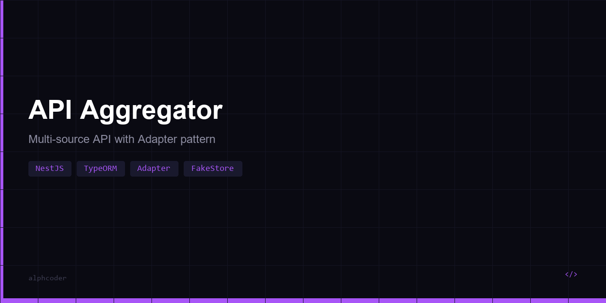

# 🔄 API Aggregator

Сервис агрегации данных из нескольких внешних API в единый унифицированный формат — **NestJS** + **TypeORM** + **PostgreSQL**.

Забирает товары из разных источников (FakeStore API, DummyJSON), нормализует в единую схему и сохраняет в PostgreSQL. Поддерживает автоматическую синхронизацию по cron и легко расширяется новыми провайдерами через паттерн Adapter.

## Архитектура

```
┌──────────────────┐     ┌──────────────────┐
│  FakeStore API   │     │  DummyJSON API   │
└────────┬─────────┘     └────────┬─────────┘
         │                        │
   ┌─────▼──────┐          ┌─────▼──────┐
   │ FakeShop   │          │ DummyJson  │
   │ Adapter    │          │ Adapter    │
   └─────┬──────┘          └─────┬──────┘
         │    ProviderAdapter    │
         │    interface          │
         └──────────┬────────────┘
                    │ UnifiedProduct
              ┌─────▼──────┐
              │  Unified   │
              │  Service   │
              │  (upsert)  │
              └─────┬──────┘
              ┌─────▼──────┐
              │ PostgreSQL │
              │ JSONB +    │
              │ UNIQUE idx │
              └────────────┘
```

## Паттерн Adapter

Каждый внешний API реализует интерфейс `ProviderAdapter`:

```typescript
interface ProviderAdapter {
  readonly name: string;
  fetchProducts(params?: Record<string, any>): Promise<UnifiedProduct[]>;
  fetchProduct(externalId: string): Promise<UnifiedProduct | null>;
}
```

Добавить новый источник = создать один файл-адаптер + зарегистрировать в модуле.

## Унифицированный формат

```typescript
interface UnifiedProduct {
  externalId: string;         // ID в источнике
  provider: string;           // fakeshop | dummyjson | ...
  name: string;
  description: string;
  price: number;
  currency: string;
  category: string;
  imageUrl: string;
  inStock: boolean;
  attributes: Record<string, any>;  // JSONB — rating, brand, etc.
  rawData: Record<string, any>;     // JSONB — оригинальный ответ API
  fetchedAt: Date;
}
```

## Функционал

- **Мульти-провайдер** — 2 адаптера из коробки, легко добавить новые
- **Автосинхронизация** — `@Cron(EVERY_HOUR)` обновляет данные
- **Upsert** — дубликаты обновляются, не дублируются (UNIQUE constraint)
- **JSONB** — атрибуты и raw data хранятся в JSONB для гибкости
- **Статистика** — `COUNT`, `AVG`, `FILTER` по провайдерам (чистый SQL)
- **Поиск** — ILIKE по названию, фильтр по провайдеру и категории

## Стек

| Компонент | Технология |
|-----------|------------|
| Фреймворк | NestJS (DI, Modules, Decorators) |
| ORM | TypeORM (entities, upsert, query builder) |
| БД | PostgreSQL (JSONB, UNIQUE, ILIKE) |
| Планировщик | @nestjs/schedule (Cron) |
| HTTP-клиент | Axios |
| Типизация | TypeScript (интерфейсы, дженерики) |

## API

| Метод | URL | Описание |
|-------|-----|----------|
| GET | /api/products | Унифицированный список (search, provider, category) |
| GET | /api/products/stats | Статистика по провайдерам |
| GET | /api/products/:id | Один продукт |
| GET | /api/providers | Список провайдеров |
| POST | /api/providers/sync | Синхронизировать все |
| POST | /api/providers/:name/sync | Синхронизировать один |

## Быстрый старт

```bash
git clone https://github.com/alphcoder/api-aggregator.git
cd api-aggregator
npm install

# PostgreSQL должен быть запущен
# Создайте базу: CREATE DATABASE api_aggregator;

npm run dev

# Синхронизировать данные
curl -X POST http://localhost:3000/api/providers/sync
```

## Структура

```
api-aggregator/
├── src/
│   ├── main.ts
│   ├── app.module.ts
│   ├── common/
│   │   └── interfaces.ts          # UnifiedProduct, ProviderAdapter
│   └── modules/
│       ├── providers/
│       │   ├── adapters/
│       │   │   ├── fakeshop.adapter.ts    # FakeStore API → Unified
│       │   │   └── dummyjson.adapter.ts   # DummyJSON API → Unified
│       │   ├── providers.service.ts       # Sync + Cron
│       │   └── providers.controller.ts
│       └── unified/
│           ├── product.entity.ts          # TypeORM + JSONB
│           ├── unified.service.ts         # Upsert, Search, Stats
│           └── unified.controller.ts
├── package.json
└── tsconfig.json
```

## Лицензия

MIT
